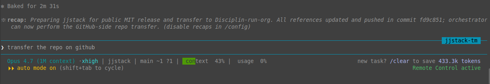

<h1 align="center">jjstack</h1>

<p align="center">
  <strong>Claude Code, with the lessons baked in.</strong><br>
  A curated UX layer on top of <a href="https://github.com/garrytan/gstack">gstack</a> that turns hard-won product knowledge into reusable skills, references, and quality floors.
</p>

<p align="center">
  
  
  
  
</p>

---

## Why jjstack

After two decades of shipping security and AI products, I noticed every team
relearns the same lessons the hard way:

- "Don't ship without an OKR for it."
- "Test the corner cases at Kano level 1, not just the happy path."
- "Production truth beats staging confidence beats local hope."
- "The PM who kills 10 features did more than the PM who shipped 15."

These are not opinions — they're scars. **jjstack encodes them as skills,
references, and quality gates so every Claude Code session inherits them
automatically.** No more re-explaining your testing standards in every
prompt. No more 8/10 reviews shipping as good enough.

jjstack does not replace gstack — it stands on its shoulders. Same command
names you already know (`/review`, `/qa`, `/ship`), enhanced behavior, plus
a library of original skills the gstack base doesn't ship.

---

## The Three Pillars

jjstack ships three deeply integrated knowledge bases — each with a
**philosophy reference** (the why) and an **adversarial review skill**
(the audit). They cross-reference each other but never duplicate.

| Discipline | Philosophy Reference | Review Skill | What it audits |
|------------|---------------------|--------------|----------------|
| **Product** | `product-management.md` (12 sections) | `/product-manager-review` | OKR alignment, Kano, scope, JTBD, kill list |
| **QA** | `qa-philosophy.md` (11 sections) | `/qa-review` | Test depth, type balance, production verification, mutation score |
| **Code** | `coding-dna.md` + `unit-test-philosophy.md` | `/unit-test-builder` + `/python-coder` | Coding DNA, adversarial testing, mutation testing |

Together they implement the full vision-to-code stack:

```
Vision (century)
  └─ Mission (decade, BHAG)
       └─ SMAC Recipe (years)
            └─ Product-Led OKRs (quarterly: 3 KRs — Quantity / Quality / Efficiency)
                 └─ KPIs (daily measurement, visible to all)
                      └─ Extended Kano Model (10 levels, Steam Train)
                           └─ BDD Gherkin Hierarchy (Capability → Feature → Behavior)
                                └─ API First → CLI → GUI
                                     └─ Primitives Over Frameworks
                                          └─ Test-Driven Development
                                               └─ Coding DNA (security-first, cost-efficient)
```

Load it any time with `/dev-philosophy`. Apply a layer with `/kano-model`,
`/product-manager-review`, `/qa-review`, or `/unit-test-builder`.

---

## Quick Start

```bash
git clone https://github.com/Disciplin-run-org/jjstack.git ~/.claude/skills/jjstack
cd ~/.claude/skills/jjstack && ./setup
```

Setup auto-installs gstack if missing, downloads security review references
(Anthropic, Sentry, OWASP), and links every jjstack skill into
`~/.claude/skills/`. Open Claude Code in any repo and start shipping.

**Prerequisites:** [Claude Code](https://claude.ai/claude-code), `git`,
`jq`, `curl`. No build step. No daemon. No dependencies you don't already
have on a developer machine.

---

## What it changes vs gstack

| Enhancement | gstack | jjstack |
|-------------|--------|---------|
| Review quality target | 8/10 | **10/10** (configurable) |
| Quality iterations | 3 max | 3 + fresh-reviewer adversarial passes |
| Output location | `~/.gstack/` (invisible) | **`{repo}/jjstack/`** (version-controlled) |
| DNA injection | None | Pluggable voice + coding standards |
| README maintenance | None | Auto-create/update after every skill run |
| Permission friction | Manual approve every time | Smart auto-approve with Haiku risk classifier |
| MCP resilience | Manual reconnect | Auto-reconnect with retry tracking |
| Auto-updates | gstack-only | jjstack checks on every skill use |
| Prompt-injection guard | None | PreToolUse hook scans markdown writes |
| Failure log | None | PostToolUse hook records non-zero bash exits for promotion |

Wrapper skills keep gstack's command names — `/plan-ceo-review`,
`/plan-eng-review`, `/qa`, `/review`, `/ship`, etc. — and add the
enhancements transparently.

---

## Skills

42 skills across product, QA, code, security, ops, and meta. Highlights:

### Product Management
| Skill | What it does |
|-------|--------------|
| `/product-manager-review` | Adversarial PM audit across 8 dimensions. Outputs kill list. |
| `/kano-model` | Loads Extended Kano Model (Steam Train, 10 levels). |
| `/dev-philosophy` | Loads the full 11-layer Vision-to-Code framework. |
| `/office-hours` | Design doc workflow with quality loop and DNA injection. |

### QA & Testing
| Skill | What it does |
|-------|--------------|
| `/qa-review` | QA health audit across 8 dimensions. Outputs test kill list. |
| `/unit-test-builder` | Generate TDD test suites with adversarial thinking. |
| `/jj-qa` | QA operational rules: cleanup, Docker-first, Kano-driven depth. |
| `/qa` / `/qa-only` | Wrapper skills with jj-qa rules and quality loop. |

### Security & Code Review
| Skill | What it does |
|-------|--------------|
| `/security-review` | 10-phase security audit combining Anthropic + Sentry + OWASP. |
| `/cso` | Adversarial security audit with quality loop to 10/10. |
| `/review` | Pre-landing review with deeper adversarial passes. |
| `/two-stage-review` | Spec compliance first, then code quality. |
| `/receiving-code-review` | Systematic processing of review feedback (no silent capitulation). |

### Engineering & Ops
| Skill | What it does |
|-------|--------------|
| `/python-coder` | Python coding with embedded test mechanics (Hypothesis, mutmut). |
| `/heal` | Infrastructure heal framework — your senior Ops Manager. |
| `/mcp-server` | Scaffolds FastMCP servers with streamable HTTP. |
| `/github-setup` | Repo init with semver auto-bump GitHub Actions. |
| `/ship` / `/land-and-deploy` | Full ship-and-verify workflow. |
| `/investigate` | Root cause analysis with verified contributing-factors tree. |
| `/canary` | Post-deploy monitoring against production baselines. |

### Meta & Workflow
| Skill | What it does |
|-------|--------------|
| `/state-doc` | Live `STATE.md` that survives `/clear`, `/compact`, restarts. |
| `/work-order` | Context/Deliverables/Verify/Done template for sub-agent delegation. |
| `/lean` | Cost-lean execution — explicit budgets, no polishing loops. |
| `/worktrees` | Git worktrees for parallel branches and isolated experiments. |
| `/verify-before-done` | Mandatory pre-completion gate that captures real test/lint output. |
| `/writing-skills` | Meta-skill for authoring new jjstack skills. |
| `/jjstack-repair` | Repairs symlinks after gstack updates overwrite them. |

Plus wrapper enhancements for `/plan-ceo-review`, `/plan-eng-review`,
`/plan-design-review`, `/plan-devex-review`, `/design-review`,
`/design-consultation`, `/design-shotgun`, `/design-html`, `/document-release`,
`/retro`, `/autoplan`, `/checkpoint`, `/codex`, `/freeze`, `/guard`, `/learn`,
`/medical-translation-qa`, `/setup-deploy`, `/setup-browser-cookies`,
`/gdocs-writer`, `/devex-review`, and more.

Run any skill in Claude Code. The descriptions trigger automatically on
relevant phrases.

---

## The Reference Library

jjstack ships 15 reference documents — the encoded knowledge each skill
loads. Read them directly or let skills load them for you.

| Reference | What's inside |
|-----------|--------------|
| `dev-philosophy.md` | The 11-layer Vision → Mission → SMAC → OKRs → KPIs → BDD → API-first → Primitives → TDD → DNA stack |
| `coding-dna.md` | 32 Always rules, 23 Never rules, 18 Anti-AI Tells. Calibration anchors with real examples. |
| `kano-model.md` | Extended Kano (Steam Train, 10 levels) for feature prioritization and kill discipline |
| `product-management.md` | 4P:90 framework, OKR Quantity/Quality/Efficiency, JTBD, RICE, scope control toolbox, agentic PM |
| `qa-philosophy.md` | Test type taxonomy, testing trophy, four-bucket failure triage, AI/MCP testing traps, production QA |
| `unit-test-philosophy.md` | Adversarial thinking, boundary analysis, mutation testing, property-based testing |
| `product-scaffold.md` | Standard capability layout (MCP Core / Auxiliary / Extended / Foundation / CLI / Web UI / Tech / Design) |
| `quality-loop.md` | Iteration protocol — fix AI-FIXABLE, escalate NEEDS-HUMAN, exit at score or convergence |
| `root-cause-analysis.md` | Verified contributing-factors tree (replaces 5 Whys with evidence-gated nodes) |
| `spec-cleanup-playbook.md` | Five smell tests for capability-level spec cleanup before the QA loop |
| `hard-gate-convention.md` | The HARD-GATE pattern for skills that must block until verified |
| `definition-of-done.md` | The canonical 10-rung "done-done" Definition of Done + reporting rule |
| `memory-promotion.md` | When recurring patterns should be promoted to memory or skills |
| `output-capture.md` | Protocol for copying gstack outputs into `{repo}/jjstack/` |
| `owasp-security/` | Language-specific security quirks — the layer below `/security-review` |

These references are the durable layer. Skills come and go; the philosophy
stays.

---

## Hooks

jjstack ships four optional hooks that ride along with every Claude Code
session.

**`auto-approve-safe.sh`** — A smart permission gate. Read-only tools always
pass. Bash commands get sent to Claude Haiku for LOW/MEDIUM/HIGH risk
classification. LOW commands auto-approve; MEDIUM/HIGH defer to you.
Fail-closed when the API is unreachable.

**`injection-guard.sh`** — A PreToolUse hook on `Write`/`Edit` that scans
markdown headed for disk and blocks high-confidence prompt-injection
patterns before they land in a file that a future model read might execute.
Categories blocked include override-instruction phrases, fake system-tag
framing, Unicode tag steganography (U+E0000 range), role-reprogramming
language, and imperative tool-invocation framing. High-precision by design;
non-markdown writes are skipped entirely.

**`error-detector.sh`** — A PostToolUse hook on `Bash` that records every
non-zero exit to `~/.jjstack/command-failures.jsonl`. Patterns recurring
3+ times become candidates for promotion to memory or a skill. Query with:

```bash
jq -r '.command' ~/.jjstack/command-failures.jsonl | sort | uniq -c | sort -rn | head
```

**`mcp-reconnect.sh`** — A PostToolUseFailure hook that reconnects MCP
servers automatically on disconnection. Up to 3 retries before escalating.

---

## Statusline + Recap

jjstack ships a Claude Code statusline that packs model, project, branch,
context %, usage %, auto-mode, and contextual hints into one band — plus
an inline recap of the last completed task above the prompt.

<p align="center">
  
</p>

What you see above:

- **Statusline (lower band)** — model + reasoning effort, project, git
  branch with dirty/untracked counts, context usage %, API usage %,
  auto-mode indicator with keyboard cycle hint, save-tokens hint when
  context fills up.
- **Recap (upper band)** — one-line summary of the last completed task
  with the commit hash. Auto-recap is on by default; disable via
  `/config`.
- **Worker label** (top right, `jjstack-tm` here) — tubemail-channel
  name when running as a worker session.

Configure defaults at install time or by editing `~/.jjstack/config`.

---

## Configuration

Global defaults in `jjstack.config.yaml`:

```yaml
review:
  min_score: 10           # quality target (gstack default: 8)
  max_iterations: 3       # additional passes after gstack's loop
  adversarial_passes: 2   # review depth (gstack default: 1)

output:
  location: repo          # "repo" or "home"
  repo_subdir: jjstack    # subdirectory name in repo

dna:
  voice: null             # path to voice DNA file (optional)
  coding: ~/.claude/skills/jjstack/references/coding-dna.md
```

Per-project override in `.jjstack.config.yaml` at your repo root. Keys
merge on top of global defaults — set `min_score: 8` in a prototype to
ease the gate, leave it at 10 in production code.

---

## How it works

Two architectural patterns:

**Wrapper skills** (most of the catalog) — read jjstack config, optionally
load DNA files, then delegate to the corresponding gstack skill via
`cat`. After gstack completes, jjstack runs post-enhancement: quality loop
to 10/10, output capture into `{repo}/jjstack/`, README maintenance.

**Layered skills** (`/security-review`, `/product-manager-review`,
`/qa-review`, `/unit-test-builder`) — pure jjstack skills that load
multiple reference documents and run their own multi-phase pipelines with
sub-agent verification.

Install replaces gstack's symlinks in `~/.claude/skills/` with jjstack
symlinks. Same command names. Enhanced behavior. Uninstall restores the
originals.

---

## Auto-updates

jjstack checks for updates on first skill use (cached 60 minutes). When a
new version is available, you're asked to upgrade. Updates are a
`git pull` — symlinks resolve to new content immediately. Security review
references (Anthropic, Sentry) auto-update on each `./setup` run via
`git pull --ff-only`.

---

## Battle-tested

jjstack powers an active multi-product ecosystem:

- **LeanSpecs** — hierarchical product spec framework with BDD generation
- **Iris-QA** — hybrid QA framework (pytest-bdd + AI augmentation)
- **Quartermaster** — engineering-manager orchestrator routing work between
  Claude Code workers
- **TubeMail** — transport layer for inter-session work routing
- **Actuatrix** — independent KPI engine

Every spec, every test, every commit in those repos passes through jjstack
skills. The friction it removes is real. The discipline it enforces is real.

---

## Related tools

jjstack intentionally does not ship the full
[`obra/superpowers`](https://github.com/obra/superpowers) methodology —
several superpowers skills overlap with jjstack's own variants
(`/office-hours`, `/plan-*-review`, `/ship`, `/review`, `/land-and-deploy`)
and carry more differentiated jjstack conventions. jjstack has borrowed
the patterns it found most valuable (`/two-stage-review`, `/worktrees`,
`/verify-before-done`, `/writing-skills`, `/receiving-code-review`, the
HARD-GATE convention) with attribution.

If you want the full superpowers methodology in parallel:

```bash
/plugin install superpowers@claude-plugins-official
```

Both distributions coexist. Pick either per task; use both when the
workflows compose.

---

## Acknowledgments

- [gstack](https://github.com/garrytan/gstack) by Garry Tan — the foundation jjstack stands on
- [obra/superpowers](https://github.com/obra/superpowers) — patterns borrowed and attributed
- [Anthropic](https://github.com/anthropics) — official security-review methodology
- [Sentry](https://github.com/getsentry) — investigation-first security methodology
- [agamm/owasp-security](https://github.com/agamm/skill-owasp-security) — OWASP Top 10:2025 + Agentic AI ASI
- Andrej Karpathy — for the prompt that started this: "I don't think I've typed like a line of code probably since December"

---

## Uninstall

```bash
cd ~/.claude/skills/jjstack && ./uninstall
```

Restores original gstack symlinks. Removes only jjstack-specific hook
entries (preserves your other hooks). Your project output
(`{repo}/jjstack/`) and config files are left intact.

---

## License

MIT — see [LICENSE](LICENSE).

Use it. Fork it. Make it your own. If you ship something cool with it,
let me know.
